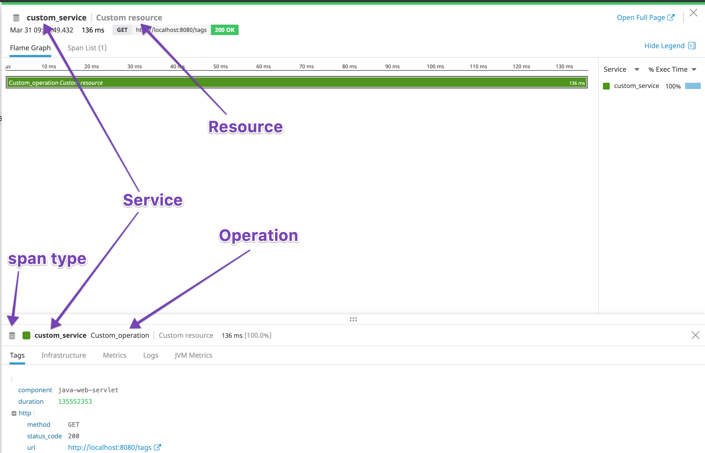

# Datado APM Java examples

The goal of this repo is to be a source of runnable code examples for Java APM.

---

### Asynchronous workers - `com.datadog.async`
When you have two threads communicatins over a shared object like a queue, the context trace must be passed manually. This example show how to extract the trace context and rebuild it on the other side.
Two servelts are also made available to illustrate the differences between with and without context propagation.
- `/default` - No context propagation
- `/instrumented` - With context propagation

### J2EE Filters - `com.datadog.filters`
In some cases, you want to augument the default servlet instrumenation with extra tags extracted from the HTTP request.  [J2EE filters](https://www.oracle.com/technetwork/java/filters-137243.html) are a convinient way of achiving it from a central place. On this example, we set the span operation name from the HTTP header `operation` when it exists.

---

### kafka - `com.datadog.kafka`
This examples shows how Datadog automatically instruments Kafka producers and consumers.  There is no need of custom code for context propagation.  The context propagation is done using Kafka record headers, so it does not interfere with the message.
Another usually very useful parameter here is `DD_SERVICE_MAPPING`.  Every kafka client span by default gets tagged as `kafka`.  If you have multiple services activing as kafka clients, you might want to distinguish between them.  It can be done using `DD_SERVICE_MAPPING` on each service.

e.g.: `DD_SERVICE_MAPPING=kafka:kafka-serviceA`

Try calling the kakfa demo with the environment variable above and check the difference.

---

### Logging - `com.datadog.logging`
Datadog dog supports the three main Java logging frameworks (log4j, log4j2, and SLF4J).
This example demostrates how the autoinstrumentation works with these frameworks. When running your code, remember to enable `DD_LOGS_INJECTION` since it defaults to `false`.

---

### Custom tags - `com.datadog.tags`

This example illustrates how you can set custom tags on spans, including change properties like `operation`, `resource`, `service`, and `span type`.



---

## Running locallly

If you want to run it locally, clone this repo and build using `gradle`.  The acceptable values for the demo parameter are:
- async
- filters
- kafka
- logging
- tags

```
$ git clone https://github.com/yafernandes/apm-java-examples.git
$ cd apm-java-examples
$ gradle shadowJar
$ java -javaagent:<dd-java-agent.jar> -jar build/libs/apm-examples.jar
Missing required option '--demo=<demo>'
Usage: <main class> [-h] -d=<demo> [-p=<port>] [-s=<bootstrapServers>]
  -d, --demo=<demo>   Demo name
  -h, --help          Display a help message
  -p, --port=<port>   Jetty port
  -s, --boostrap=<bootstrapServers>
                      Bootstrap servers
```
